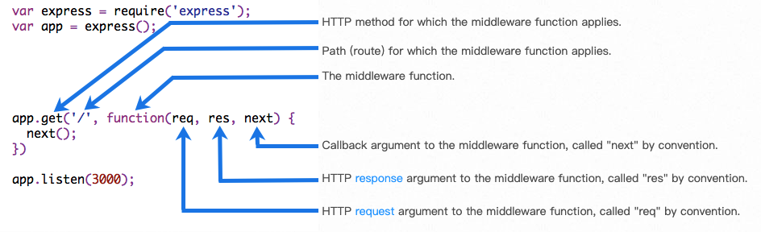

[toc]

# Express
## 简介
Express 是一个保持最小规模的灵活的 Node.js Web 应用程序开发框架，为 Web 和移动应用程序提供一组强大的功能。

Express 是一个自身功能极简，完全是由路由和中间件构成一个的 web 开发框架：从本质上来说，一个 Express 应用就是在调用各种中间件。

## 应用生成器
通过应用生成器工具 express-generator 可以快速创建一个应用的骨架。

express-generator 包含了 express 命令行工具。
```shell
npm install express-generator -g
```
创建一个名称为 myapp 的 Express 应用，并且设置为使用 Pug 模板引擎（view engine）：
```shell
express --view=pug myapp
```
通过生成器创建的应用一般都有如下目录结构：
```shell
.
├── app.js // 主文件，设置中间件间，被www调用
├── bin
│   └── www // 启动脚本，建立了一个server，监听了端口，不用这个启动就自己写在app.js中，更清晰。
├── package.json
├── public // 静态资源
│   ├── images
│   ├── javascripts
│   └── stylesheets
│       └── style.css
├── routes // 路由，设置了一堆get post方法的路由
│   ├── index.js
│   └── users.js
└── views // html或者模板文件，这里用的jade
    ├── error.jade
    ├── index.jade
    └── layout.jade
```

## 中间件
中间件（Middleware） 是一个函数，它可以访问请求对象（request object (req)）, 响应对象（response object (res)）, 和 web 应用中处于请求-响应循环流程中的中间件，一般被命名为 next 的变量。

中间件的功能包括：
* 执行任何代码。
* 修改请求和响应对象。
* 终结请求-响应循环。
* 调用堆栈中的下一个中间件。

如果当前中间件没有终结请求-响应循环，则必须调用 next() 方法将控制权交给下一个中间件，否则请求就会挂起。

中间件函数被调用时的组成部分：


Express 应用可使用如下几种中间件：
* 应用级中间件
* 路由级中间件
* 错误处理中间件
* 内置中间件
* 第三方中间件

使用可选则挂载路径，可在应用级别或路由级别装载中间件。另外，你还可以同时装在一系列中间件函数，从而在一个挂载点上创建一个子中间件栈。

## 路由
路由是指如何定义应用的端点（URIs）以及如何响应客户端的请求。

路由是由一个 URI、HTTP 请求（GET、POST等）和若干个句柄组成，它的结构如下： `app.METHOD(path, [callback...], callback)`， app 是 express 对象的一个实例， METHOD 是一个 HTTP 请求方法， path 是服务器上的路径， callback 是当路由匹配时要执行的函数。

下面是一个基本的路由示例：
```js
var express = require('express');
var app = express();

// respond with "hello world" when a GET request is made to the homepage
app.get('/', function(req, res) {
  res.send('hello world');
});
```

### 路由方法
路由方法源于 HTTP 请求方法，和 express 实例相关联。

下面这个例子展示了为应用跟路径定义的 GET 和 POST 请求：
```js
// GET method route
app.get('/', function (req, res) {
  res.send('GET request to the homepage');
});

// POST method route
app.post('/', function (req, res) {
  res.send('POST request to the homepage');
});
```

Express 定义了如下和 HTTP 请求对应的路由方法： get, post, put, head, delete, options, trace, copy, lock, mkcol, move, purge, propfind, proppatch, unlock, report, mkactivity, checkout, merge, m-search, notify, subscribe, unsubscribe, patch, search, 和 connect。

有些路由方法名不是合规的 JavaScript 变量名，此时使用括号记法，比如：`app['m-search']('/', function ...`。

app.all() 是一个特殊的路由方法，没有任何 HTTP 方法与其对应，它的作用是对于一个路径上的所有请求加载中间件。

在下面的例子中，来自 “/secret” 的请求，不管使用 GET、POST、PUT、DELETE 或其他任何 http 模块支持的 HTTP 请求，句柄都会得到执行。
```js
app.all('/secret', function (req, res, next) {
  console.log('Accessing the secret section ...');
  next(); // pass control to the next handler
});
```

### 路由路径
路由路径和请求方法一起定义了请求的端点，它可以是字符串、字符串模式或者正则表达式。

Express 使用 path-to-regexp 匹配路由路径，请参考文档查阅所有定义路由路径的方法。 Express Route Tester 是测试基本 Express 路径的好工具，但不支持模式匹配。

查询字符串不是路由路径的一部分。

使用字符串的路由路径示例：
```js
// 匹配根路径的请求
app.get('/', function (req, res) {
  res.send('root');
});

// 匹配 /about 路径的请求
app.get('/about', function (req, res) {
  res.send('about');
});

// 匹配 /random.text 路径的请求
app.get('/random.text', function (req, res) {
  res.send('random.text');
});
```
使用字符串模式的路由路径示例：
```js
// 匹配 acd 和 abcd
app.get('/ab?cd', function(req, res) {
  res.send('ab?cd');
});

// 匹配 abcd、abbcd、abbbcd等
app.get('/ab+cd', function(req, res) {
  res.send('ab+cd');
});

// 匹配 abcd、abxcd、abRABDOMcd、ab123cd等
app.get('/ab*cd', function(req, res) {
  res.send('ab*cd');
});

// 匹配 /abe 和 /abcde
app.get('/ab(cd)?e', function(req, res) {
 res.send('ab(cd)?e');
});
```

字符 ?、+、* 和 () 是正则表达式的子集，- 和 . 在基于字符串的路径中按照字面值解释。

使用正则表达式的路由路径示例：
```js
// 匹配任何路径中含有 a 的路径：
app.get(/a/, function(req, res) {
  res.send('/a/');
});

// 匹配 butterfly、dragonfly，不匹配 butterflyman、dragonfly man等
app.get(/.*fly$/, function(req, res) {
  res.send('/.*fly$/');
});
```

### 路由句柄
可以为请求处理提供多个回调函数，其行为类似中间件。唯一的区别是这些回调函数有可能调用 next('route') 方法而略过其他路由回调函数。可以利用该机制为路由定义前提条件，如果在现有路径上继续执行没有意义，则可将控制权交给剩下的路径。

路由句柄有多种形式，可以是一个函数、一个函数数组，或者是两者混合，如下所示.

使用一个回调函数处理路由：
```js
app.get('/example/a', function (req, res) {
  res.send('Hello from A!');
});
```

使用多个回调函数处理路由（记得指定 next 对象）：
```js
app.get('/example/b', function (req, res, next) {
  console.log('response will be sent by the next function ...');
  next();
}, function (req, res) {
  res.send('Hello from B!');
});
```

使用回调函数数组处理路由：
```js
var cb0 = function (req, res, next) {
  console.log('CB0');
  next();
}

var cb1 = function (req, res, next) {
  console.log('CB1');
  next();
}

var cb2 = function (req, res) {
  res.send('Hello from C!');
}

app.get('/example/c', [cb0, cb1, cb2]);
```

混合使用函数和函数数组处理路由：
```js
var cb0 = function (req, res, next) {
  console.log('CB0');
  next();
}

var cb1 = function (req, res, next) {
  console.log('CB1');
  next();
}

app.get('/example/d', [cb0, cb1], function (req, res, next) {
  console.log('response will be sent by the next function ...');
  next();
}, function (req, res) {
  res.send('Hello from D!');
});
```

### 响应方法
下表中响应对象（res）的方法向客户端返回响应，终结请求响应的循环。如果在路由句柄中一个方法也不调用，来自客户端的请求会一直挂起。

| 方法 | 描述 |
| :-- | :-- |
| res.download() | 提示下载文件。 |
| res.end() | 终结响应处理流程。 |
| res.json() | 发送一个 JSON 格式的响应。 |
| res.jsonp() | 发送一个支持 JSONP 的 JSON 格式的响应。 |
| res.redirect() | 重定向请求。 |
| res.render() | 渲染视图模板。 |
| res.send() | 发送各种类型的响应。 |
| res.sendFile | 以八位字节流的形式发送文件。 |
| res.sendStatus() | 设置响应状态代码，并将其以字符串形式作为响应体的一部分发送。 |

## 错误处理
定义错误处理中间件和定义其他中间件一样，除了需要 4 个参数，而不是 3 个，其格式如下 (err, req, res, next)。例如：
```js
app.use(function(err, req, res, next) {
  console.error(err.stack);
  res.status(500).send('Something broke!');
});
```
在其他 app.use() 和路由调用后，最后定义错误处理中间件，比如：
```js
var bodyParser = require('body-parser');
var methodOverride = require('method-override');

app.use(bodyParser());
app.use(methodOverride());
app.use(function(err, req, res, next) {
  // 业务逻辑
});
```
中间件返回的响应是随意的，可以响应一个 HTML 错误页面、一句简单的话、一个 JSON 字符串，或者其他任何您想要的东西。

为了便于组织（更高级的框架），您可能会像定义常规中间件一样，定义多个错误处理中间件。比如您想为使用 XHR 的请求定义一个，还想为没有使用的定义一个，那么：
```js
var bodyParser = require('body-parser');
var methodOverride = require('method-override');

app.use(bodyParser());
app.use(methodOverride());
app.use(logErrors);
app.use(clientErrorHandler);
app.use(errorHandler);
```
logErrors 将请求和错误信息写入标准错误输出、日志或类似服务：
```js
function logErrors(err, req, res, next) {
  console.error(err.stack);
  next(err);
}
```
clientErrorHandler 的定义如下（注意这里将错误直接传给了 next）：
```js
function clientErrorHandler(err, req, res, next) {
  if (req.xhr) {
    res.status(500).send({ error: 'Something blew up!' });
  } else {
    next(err);
  }
}
```
errorHandler 能捕获所有错误，其定义如下：
```js
function errorHandler(err, req, res, next) {
  res.status(500);
  res.render('error', { error: err });
}
```

### 缺省错误处理句柄
Express 内置了一个错误处理句柄，它可以捕获应用中可能出现的任意错误。这个缺省的错误处理中间件将被添加到中间件堆栈的底部。

如果你向 next() 传递了一个 error ，而你并没有在错误处理句柄中处理这个 error，Express 内置的缺省错误处理句柄就是最后兜底的。最后错误将被连同堆栈追踪信息一同反馈到客户端。堆栈追踪信息并不会在生产环境中反馈到客户端。

设置环境变量 NODE_ENV 为 “production” 就可以让应用运行在生产环境模式下。

如果你已经开始向 response 输出数据了，这时才调用 next() 并传递了一个 error，比如你在将向客户端输出数据流时遇到一个错误，Express 内置的缺省错误处理句柄将帮你关闭连接并告知 request 请求失败。

因此，当你添加了一个自定义的错误处理句柄后，如果已经向客户端发送包头信息了，你还可以将错误处理交给 Express 内置的错误处理机制。
```js
function errorHandler(err, req, res, next) {
  if (res.headersSent) {
    return next(err);
  }
  res.status(500);
  res.render('error', { error: err });
}
```

## 参考文献
* [http://www.expressjs.com.cn/](http://www.expressjs.com.cn/)
* [Node.js进阶与Express框架及知识图谱](https://limuzhi.com/2016/08/20/nodejs%E8%BF%9B%E9%98%B6%E4%B8%8Eexpress%E6%A1%86%E6%9E%B6/)
* [https://www.w3cschool.cn/expressapi/](https://www.w3cschool.cn/expressapi/)